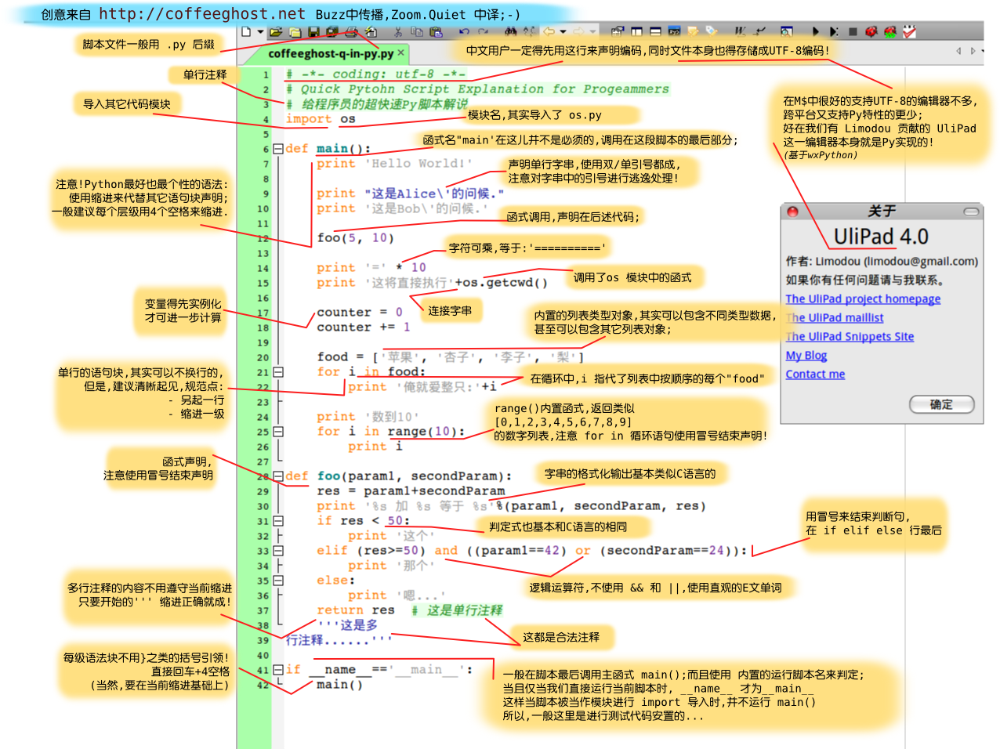

# Python 私人教程

## 背景

## 安装

## 配置

## 使用

[11](http://www.zhihu.com/question/20702054/answer/15908321)

[111](http://wiki.zoomquiet.io/pythonic/MinimalistPyStart)

[1111](http://wiki.zoomquiet.io/pythonic/MinimalistProgramStart)

[如何向完全没有任何编程知识的人介绍编程](http://blog.ghostunix.org/2014/01/21/%E5%A6%82%E4%BD%95%E5%90%91%E5%AE%8C%E5%85%A8%E6%B2%A1%E6%9C%89%E4%BB%BB%E4%BD%95%E7%BC%96%E7%A8%8B%E7%9F%A5%E8%AF%86%E7%9A%84%E4%BA%BA%E4%BB%8B%E7%BB%8D%E7%BC%96%E7%A8%8B/)
## 体验

